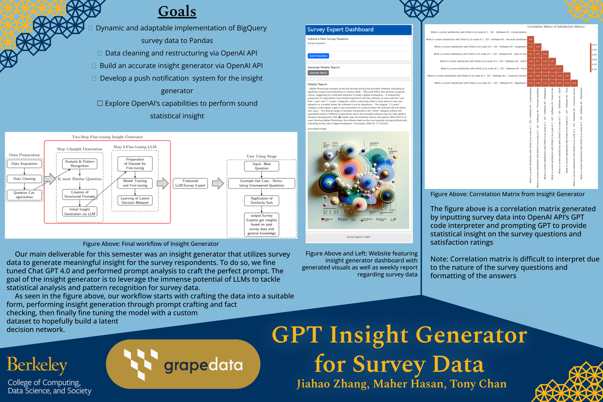
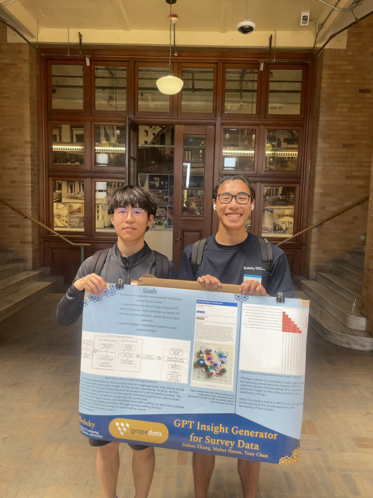

We received the Cloud Computing Award for our project "GPT Insight Generator for Survey Data". It is quite amazing; we worked a lot for this research program. Here is the poster:

And this is a photo of the team (I am on the left, Tony is on the right):

This is a one-semester project with Industry company, [grapedata](https://www.grape-data.com/), a leading provider of Global B2B surveys.

You can see the award details here:
[From Data to Impact: Data Science Discovery Celebrates Nine Years of Groundbreaking Student Research](https://cdss.berkeley.edu/data-impact-data-science-discovery-celebrates-nine-years-groundbreaking-student-research)